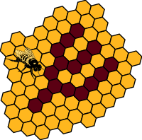
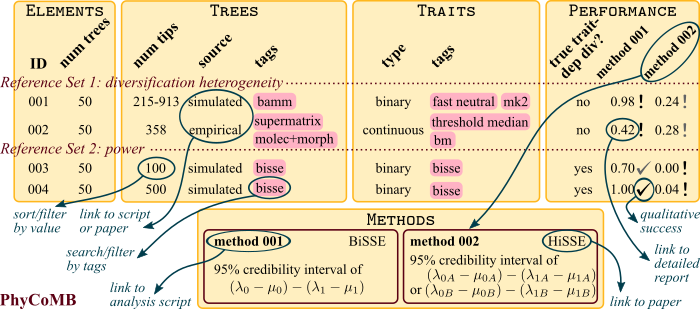

# PhyCoMB: Phylogenetic Comparative Methods Benchmarking

The goal of PhyCoMB is to facilitate robustness testing of phylogenetic comparative methods.
It will accumulate and curate testing datasets that are specifically intended to challenge methods for inferring trait evolution and lineage diversification from phylogenies.

## Why benchmarking?

A paper introducing a new phylogenetic comparative method generally includes essential simulations that examine its power and bias and reveal the parameter space in which it will be most beneficial.
These simulations typically follow the assumptions of the underlying model.
Poor behavior, however, may arise when those assumptions are not met.
Because all empirical datasets have been shaped by processes outside the assumptions of any model, methods should routinely be tested in many situations beyond their specific focus.
By revealing strengths and weaknesses before methods are widely adopted, such testing could bring greater stability to the field.

In practice, it is time-consuming or impossible for a single developer to craft diverse testing datasets that encompass the biological phenomena likely to "break" his/her new method.
Benchmarking removes some of that burden.
When there is an existing suite of datasets on which methods can be run, robustness testing and comparing performance across methods can become routine.

Benchmark tests already exist for [genome](http://assemblathon.org/) [assembly](http://busco.ezlab.org/), [multiple sequence alignment](http://lbgi.fr/balibase/), and [phylogeny estimation](http://www.cs.utexas.edu/~phylo/datasets).
Phylogenetic comparative methods could benefit from them, too.

## How far along is this project?

Well, it's at least off the ground.

A first suite of tests has been employed in a manuscript introducing a new method of state-dependent diversification
[(FiSSE, Rabosky & Goldberg, Evolution)](http://dx.doi.org/10.1111/evo.13227).

And a [grant](https://www.nsf.gov/awardsearch/showAward?AWD_ID=1655478) that includes support for developing PhyCoMB has been funded by NSF.
We eventually envision a user-friendly interface to filter and summarize testing sets, maybe like this:

